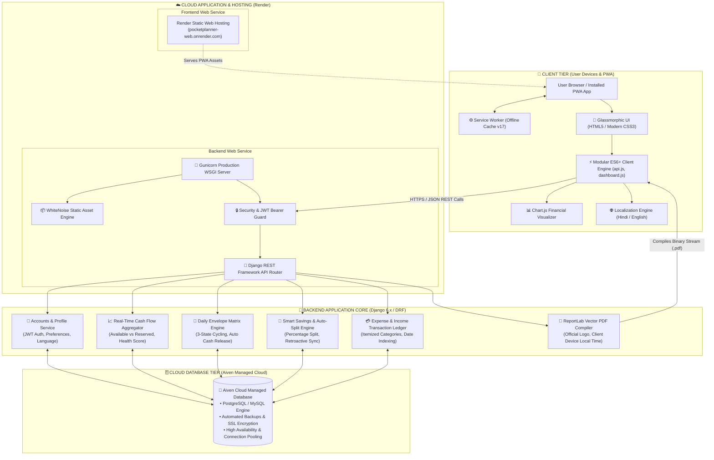

<div align="center">

  

  # 💸 PocketPlanner
  ### **Smart Personal Finance, Envelope Budgeting & Automated Wealth Building**

  [](https://pocketplanner-web.onrender.com/)
  [](https://www.djangoproject.com/)
  [](https://www.django-rest-framework.org/)
  [](https://www.python.org/)
  [](https://render.com)
  [](https://aiven.io)
  [](https://web.dev/progressive-web-apps/)
  [](LICENSE)
  [](https://github.com/Navi15032001/PocketPlanner)

  <p align="center">
    <b>A modern, bank-grade personal finance web application built for seamless cash flow tracking, envelope budgeting, percentage-based savings auto-split, and localized financial health analytics.</b>
  </p>

</div>

---

## Quick Navigation

- 🚀 [**Live Application Demo**](https://pocketplanner-web.onrender.com/)
- 📖 [Overview](#overview)
- ✨ [Key Features](#key-features)
- 🏛️ [System Architecture](#system-architecture)
- 💻 [Tech Stack](#tech-stack)
- ☁️ [Cloud Infrastructure & Deployment](#cloud-infrastructure--deployment)
- 📂 [Folder Structure](#folder-structure)
- 🚀 [Getting Started & Local Setup](#getting-started--local-setup)
- 📡 [API Endpoints Overview](#api-endpoints-overview)
- 🧪 [Testing & Verification](#testing--verification)
- 👨‍💻 [Author & Maintainer](#author--maintainer)
- 📄 [License](#license)

---

## Overview

**PocketPlanner** is an all-in-one personal financial management platform designed to eliminate financial stress and bring clarity to personal cash flows. Unlike traditional expense trackers that only record past transactions, PocketPlanner proactively manages your money using **Envelope Budgeting**, **Automated Savings Splitting**, and **Real-Time Financial Health Scoring**.

Whether you're tracking daily expenses, saving for long-term goals, or generating bank-grade monthly financial PDF statements with localized device timestamps, PocketPlanner delivers a fast, privacy-focused, and mobile-first experience.

> 🌐 **Live Web Application:** Try PocketPlanner live at [pocketplanner-web.onrender.com](https://pocketplanner-web.onrender.com/)

---

## Key Features

### 1. Real-Time Cash Flow & Financial Health
- **Live Metric Aggregation:** Instantly tracks **Current Balance**, **Available Money**, **Reserved Savings**, and **Total Monthly Expenses**.
- **Dynamic Health Scoring:** Real-time financial health diagnostic (*HEALTHY*, *MODERATE*, *CRITICAL*) based on liquidity ratios and runway safety.
- **Privacy Mode (Eye Toggle):** Mask or reveal sensitive financial figures across the dashboard with a single tap.

### 2. Smart Savings Goals & Auto-Split Engine
- **Percentage-Based Auto-Split:** Define savings goals (e.g., *Emergency Fund - 10%*, *Vacation - 5%*). Whenever income is logged, the system automatically allocates the percentage directly to the goal.
- **Retroactive Split (Past Incomes):** Option to apply newly created savings allocations across all historical income logs with one click.
- **Visual Progress & Timeline:** Track target amounts, completion percentages, and estimated completion dates.

### 3. Daily Envelope Budgeting Matrix
- **3-State Interactive Cycling:** Mark daily budget envelopes as `SPENT`, `SKIPPED`, or `PENDING`.
- **Unspent Fund Release:** Skipping a daily budget automatically frees unspent cash back into your available pool.
- **Priority Categorization:** Assign budgets with *High*, *Medium*, or *Low* priority to protect essential needs.

### 4. Bank-Grade Executive PDF & CSV Statements
- **Vector PDF Engine (ReportLab):** Generates high-resolution monthly executive financial health statements with embedded brand logo, executive KPI summaries, category spend distribution, and itemized transaction tables.
- **Device-Synchronized Timezone:** Reads exact client local time and timezone (e.g. IST `Asia/Kolkata`) from the browser to ensure 100% accurate generation timestamps.
- **CSV Data Export:** One-click structured CSV export for spreadsheets and tax accounting.

### 5. Interactive Visual Expense Calendar
- **Date-Wise Spending Grid:** Monthly interactive calendar grouping all expenses by date.
- **Drill-Down Day View:** Tap any day on the calendar to view its itemized transactions and category badges.

### 6. Localization & Modern UI
- **Dual-Language Support:** Seamlessly switch between **English 🇬🇧** and **Hindi 🇮🇳** across the entire UI.
- **Fluid Theme Engine:** Modern **Dark 🌙** and **Light ☀️** modes with smooth transitions and glassmorphism styling.
- **Responsive Layout:** Optimized for all screen sizes (1024px+ desktops, tablets, and mobile devices).

### 7. Progressive Web App (PWA)
- **Installable Application:** Installable directly on Android, iOS, Windows, and macOS without app store overhead.
- **Service Worker & Offline Cache:** Fast loading times and resilient offline caching via Service Worker.

---

## System Architecture



---

## Tech Stack

| Domain | Technology | Purpose |
| :--- | :--- | :--- |
| **Backend Framework** | **Python 3.11+ / Django 6.0** | Robust, scalable MVC framework powering the core financial logic. |
| **API Layer** | **Django REST Framework (DRF)** | RESTful API serialization, viewsets, and permission controllers. |
| **Authentication** | **SimpleJWT (JWT Tokens)** | Stateless, secure access/refresh token pair authentication. |
| **PDF Generation Engine**| **ReportLab 4.2** | High-performance programmatic vector PDF statement generation with branding logo & localized timestamp. |
| **Cloud Database** | **Aiven Managed Cloud Database** | Fully-managed PostgreSQL / MySQL cloud database with automated SSL encryption and persistent storage. |
| **Frontend UI** | **Vanilla JavaScript (ES6+), HTML5, CSS3** | Zero-dependency, ultra-fast client with glassmorphism aesthetics. |
| **Data Visualization**| **Chart.js** | Interactive doughnut and bar charts for financial health breakdown. |
| **PWA & Offline** | **Web Service Worker & Web Manifest** | Offline asset caching and native cross-platform installation. |
| **Application Hosting** | **Render Cloud Platform** | Production cloud hosting for both Frontend static site and Backend Django WSGI service. |
| **WSGI & Static Files** | **Gunicorn + WhiteNoise** | High-concurrency production Python WSGI server with optimized static delivery. |

---

## Cloud Infrastructure & Deployment

PocketPlanner leverages a modern decoupled cloud architecture:

```text
               ┌─────────────────────────────────────────────────┐
               │           Render Cloud Hosting                  │
               │                                                 │
   User ───────┼─► [Frontend Web Service] (Static PWA)           │
 (Browser/PWA) │                                                 │
               │          │ REST API (HTTPS + JWT)               │
               │          ▼                                      │
               │   [Backend Web Service] (Django + Gunicorn)     │
               └───────────────────────┬─────────────────────────┘
                                       │ Secure SSL Connection
                                       ▼
               ┌─────────────────────────────────────────────────┐
               │           Aiven Cloud Database                  │
               │   • Fully Managed PostgreSQL / MySQL            │
               │   • Automated Daily Backups & Connection Pool   │
               └─────────────────────────────────────────────────┘
```

1. **Frontend Hosting (Render):** Serves the PWA client, responsive templates, styles, and Service Worker cache (`pocketplanner-cache-v17`).
2. **Backend Web Service (Render):** Executes the Django REST Framework backend inside a production Gunicorn WSGI container.
3. **Cloud Database (Aiven):** Cloud-hosted managed database connected via secure SSL connection string (`DATABASE_URL`), ensuring data durability and high availability.

---

## Folder Structure

```text
PocketPlanner/
├── backend/                        # Django REST Backend
│   ├── accounts/                   # User authentication, JWT, profile & preferences
│   ├── budgets/                    # Daily envelope budgeting matrix & cell-toggles
│   ├── categories/                 # Category definitions & emoji icons
│   ├── dashboard/                  # Real-time cash flow & health metric aggregation
│   ├── expenses/                   # Expense fast-logging & categorization
│   ├── goals/                      # Savings goals & dynamic auto-split engine
│   ├── income/                     # Income tracking & automatic split triggers
│   ├── pocketplanner/              # Project settings, WSGI/ASGI, URLs & CORS config
│   ├── reports/                    # ReportLab PDF statement & CSV export views
│   ├── manage.py                   # Django CLI management script
│   └── requirements.txt            # Python dependencies
│
├── frontend/                       # Client-Side Application (PWA)
│   ├── css/                        # Responsive stylesheets & dark/light themes
│   ├── js/                         # Modular client scripts (api, dashboard, reports, etc.)
│   ├── dashboard.html              # Main financial overview & KPI cards
│   ├── budgets.html                # Daily envelope budget matrix
│   ├── expenses.html               # Expense logging & category filtering
│   ├── income.html                 # Income streams & auto-split triggers
│   ├── goals.html                  # Savings goals tracker
│   ├── calendar.html               # Interactive day-wise spending calendar
│   ├── reports.html                # Monthly PDF statement & CSV download portal
│   ├── profile.html / settings.html# User profile, language & theme controls
│   ├── manifest.json               # PWA configuration manifest
│   └── service-worker.js           # PWA cache controller
│
├── LICENSE                         # MIT License
├── screenshots/                    # UI mockups & architecture diagrams
└── README.md                       # Repository documentation
```

---

## Getting Started & Local Setup

Follow these step-by-step instructions to get a local copy of PocketPlanner up and running on your machine.

### Prerequisites
- **Python 3.10+** installed on your system.
- **Git** installed.
- Modern Web Browser (Chrome, Edge, Safari, Firefox).

---

### Installation Steps

#### 1. Clone the Repository
```bash
git clone https://github.com/Navi15032001/PocketPlanner.git
cd PocketPlanner
```

#### 2. Configure Backend Environment
```bash
# Navigate to backend directory
cd backend

# Create a virtual environment
python -m venv venv

# Activate virtual environment
# Windows (PowerShell):
.\venv\Scripts\Activate.ps1
# Windows (CMD):
.\venv\Scripts\activate.bat
# Linux / macOS:
source venv/bin/activate

# Install dependencies
pip install -r requirements.txt
```

#### 3. Setup Environment Variables
Create a `.env` file inside the `backend/` folder:
```env
SECRET_KEY=your-secure-django-secret-key
DEBUG=True
ALLOWED_HOSTS=127.0.0.1,localhost
DATABASE_URL=sqlite:///db.sqlite3
```
*(For production, configure `DATABASE_URL` with your Aiven Cloud connection URI).*

#### 4. Apply Migrations & Initialize Database
```bash
python manage.py makemigrations
python manage.py migrate
```

#### 5. Run the Backend Server
```bash
python manage.py runserver
```
> 🌐 Backend API will be live at: `http://127.0.0.1:8000/`

#### 6. Launch the Frontend
You can open `frontend/index.html` directly in your browser, or serve it using a local static server:
```bash
# In the frontend directory:
python -m http.server 5500
```
> 🌐 Frontend UI will be accessible at: `http://127.0.0.1:5500/`

---

## API Endpoints Overview

| Method | Endpoint | Description | Auth Required |
| :--- | :--- | :--- | :---: |
| `POST` | `/api/accounts/register/` | Register new user with baseline opening balance | ❌ |
| `POST` | `/api/accounts/login/` | Authenticate user & obtain JWT Access/Refresh token pair | ❌ |
| `GET/PATCH`| `/api/accounts/profile/` | Fetch or update user profile, language & theme | ✅ |
| `GET` | `/api/dashboard/` | Retrieve real-time cash flow & health score metrics | ✅ |
| `GET/POST`| `/api/income/` | List or record income (triggers goal auto-split) | ✅ |
| `GET/POST`| `/api/expenses/` | List or record itemized expenses | ✅ |
| `GET/POST`| `/api/budgets/` | List or create envelope budgets | ✅ |
| `POST` | `/api/budgets/<id>/cell-toggle/` | Toggle daily budget status (`SPENT`/`SKIPPED`) | ✅ |
| `GET/POST`| `/api/goals/` | List or create savings goals with auto-split % | ✅ |
| `GET` | `/api/reports/export/monthly/pdf/`| Download bank-grade localized executive PDF statement | ✅ |
| `GET` | `/api/reports/export/expenses/csv/`| Download structured financial CSV export | ✅ |

---

## Testing & Verification

PocketPlanner includes an automated end-to-end verification suite testing all 15 core features:
- Authentication & JWT cycle
- Baseline balance & Profile localization
- Goal creation, Auto-split & Retroactive split
- Daily envelope budget 3-state matrix cycling
- Itemized expenses & fast-logging
- Dashboard cash flow analytics & health scoring
- ReportLab PDF generator & localized device timestamp verification
- PWA asset cache integrity

To run the verification test suite:
```bash
python scratch/verify_all_features.py
```
```text
===========================================================================
POCKETPLANNER COMPREHENSIVE END-TO-END FEATURE VERIFICATION
===========================================================================
[PASS] 1. User Registration & Baseline Balance
[PASS] 2. JWT Login & Token Generation
[PASS] 3. Profile & Localization Settings
[PASS] 4. Universal Categories Management
[PASS] 5. Savings Goal & Auto-Split Config
[PASS] 6. Income Recording & Auto-Split Allocation
[PASS] 7. Retroactive Past Incomes Goal Split
[PASS] 8. Envelope Budget Creation & Priority
[PASS] 9. Daily Budget Matrix (Spent/Skipped/Free Cash Release)
[PASS] 10. Expense Fast-Log & Itemized Outflows
[PASS] 11. Real-Time Dashboard Cash Flow Calculations
[PASS] 12. Bank-Grade Executive PDF Report (Logo & Local Time)
[PASS] 13. CSV Financial Data Export
[PASS] 14. Visual Calendar Expense Feed
[PASS] 15. Frontend Assets, PWA Cache v17 & 1024px Layout
===========================================================================
FINAL RESULT: 15/15 FEATURES PASSED (100% HEALTHY)
===========================================================================
```

---

## Author & Maintainer

**Naveen Sharma**  
- 🐙 **GitHub:** [@Navi15032001](https://github.com/Navi15032001)
- 💼 **LinkedIn:** [Naveen Sharma](https://www.linkedin.com/in/navi1503)
- 🌐 **Live Application:** [PocketPlanner Web](https://pocketplanner-web.onrender.com/)
- 📁 **Repository:** [PocketPlanner on GitHub](https://github.com/Navi15032001/PocketPlanner)

---

## License

This project is licensed under the **MIT License** - see the [LICENSE](LICENSE) file for details.

---

<div align="center">
  <sub>Built with ❤️ for financial freedom and smart wealth management.</sub>
</div>
