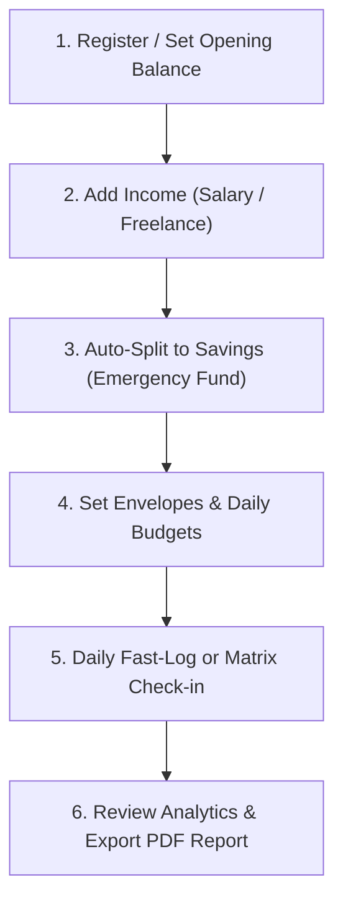

# 📘 PocketPlanner — Complete User Manual & Guide
*(पॉकेटप्लानर: इस्तेमाल करने की सम्पूर्ण और आसान मार्गदर्शिका)*

---

## 🌟 1. Introduction: What is PocketPlanner?
**PocketPlanner** ek modern, smart aur zero-stress **Personal Finance & Envelope Budgeting Web App** hai. 

Aam expense apps me aap sirf kharche likhte hain, lekin PocketPlanner aapko batata hai ki:
> **"Saare bills, daily budgets aur future savings alag rakhne ke baad, aaj mere haath me sach me kitna FREE CASH (Available Cash) bacha hai jise main bina kisi chinta ke kharch kar sakta hoon?"**

---

## 📐 2. The Core Financial Formula (गणितीय नियम)

PocketPlanner ek transparent aur mathematically bulletproof formula par chalta hai:

$$\text{Current Balance} = \text{Opening Balance} + \text{Total Income} - \text{Total Expenses}$$

$$\text{Available Cash (Free Balance)} = \text{Current Balance} - (\text{Total Budgets} + \text{Total Goal Savings})$$

| Metric | Meaning (सरल भाषा में अर्थ) | Formula / Source |
| :--- | :--- | :--- |
| 💳 **Current Bank Balance** | Aapke bank account ya wallet me kul kitna cash maujood hai. | $\text{Opening} + \text{Income} - \text{Expenses}$ |
| 🎯 **Total Reserved** | Jo paisa aapne specific kaamon (Budgets) aur Emergency/Savings Goals ke liye lock kar diya hai. | $\text{Allocated Budgets} + \text{Goal Savings}$ |
| 💰 **Available Cash** | **Aapka Real Free Cash!** Is paise ko aap bina kisi guilt ya tension ke freely use kar sakte hain. | $\text{Current Balance} - \text{Total Reserved}$ |
| 💸 **Month Expenses** | Is current month me aapne total kitna kharch kiya hai. | Sum of all expenses in current month |

---

## 🚀 3. Step-by-Step Guide: How to Use PocketPlanner

---

### 🔹 Step 1: Initial Setup & Opening Balance (शुरुआती बैलेंस)
1. PocketPlanner me login karein.
2. Sabse pehle **💵 Income** tab me jayein aur apna **Opening Balance** enter karein (e.g. ₹5,000 ya ₹25,000 jo abhi aapke account me hai).
3. Dashboard par aapka **Current Balance** aur **Available Cash** turant reflect ho jayega.

---

### 🔹 Step 2: Adding Income & Auto-Split Savings (कमाई दर्ज करना)
1. Jab bhi salary, client payment ya cash receive ho, **`+ Add Income`** button dabayein.
2. Agar aapne **Goals** me kisi goal (jaise *Emergency Fund*) ke liye **Auto-Split %** set kiya hai (e.g. 25%), toh:
   - ₹10,000 aane par ₹2,500 automatically aapke Goal me secure ho jayenge!
   - Baaki ₹7,500 aapke bank balance me add hokar budgeting ke liye ready rahenge.

---

### 🔹 Step 3: Setting Up Envelopes & Budgets (बजट बनाना)
PocketPlanner me **2 tarah ke budgets** bante hain:

1. **⚡ Daily Budget (Day-by-Day Grid)**:
   - Jaise: *Chai/Snacks (₹50/day)*, *Lunch (₹150/day)*, *Petrol/Commute (₹100/day)*.
   - Yeh aapke daily regular kharchon ke liye hota hai.
2. **📅 Monthly Full Envelope**:
   - Jaise: *Ghar ka Kiraya/Rent (₹10,000)*, *Grocery/Ration (₹5,000)*, *Electricity/WiFi (₹1,500)*.

> **💡 Auto-Allocate Balance:**
> Agar aapke paas Free Cash hai, toh **`⚡ Auto-Allocate Balance`** button dabane se system priority ke hisab se saare budgets ko auto-fund kar deta hai!

---

### 🔹 Step 4: Daily Budget & Expense Matrix (दैनिक खर्च ग्रिड का इस्तेमाल)
**Budgets** page par aapko ek interactive Calendar Matrix milta hai:

- Har din ke cell par click karke aap status badal sakte hain:
  - 🟢 **Spent (✓)**: Us din ka kharcha ho gaya! Yeh automatically **Expenses** me record ho jayega aur envelope se deduct ho jayega.
  - 🔘 **Skipped (✕)**: Maan lijiye Sunday ko aapne Chai ya Office Commute ka kharcha nahi kiya — toh **Skip** dabate hi wo ₹50 instantly unreserved hokar aapke **Available Cash** me wapas jud jayenge!
  - ⚪ **Pending (-)**: Aane wale dinon ka planned budget.

---

### 🔹 Step 5: Dashboard Fast-Log & 1-Tap Shortcuts (2-सेकंड में खर्च दर्ज करें)
Dashboard par daily kharche record karne ke liye sabse fast tool hai:

1. **1-Tap Preset Buttons**: `☕ ₹50 Chai`, `🍔 ₹200 Food`, `⛽ ₹500 Fuel`, `🛒 ₹1,000 Grocery`.
2. **⚙️ Edit Shortcuts**: Is button par click karke aap apne man-pasand shortcuts bana sakte hain:
   - Icon (☕, 🍱, 🚕, 🥛, 🎬), Name (Doodh, Snacks, Metro), Amount (₹) aur Category assign karein!
3. **Quick Form**: Amount likhein, description daalein, aur `⚡ Fast Log` dabayein — 2 second me Dashboard, Charts aur Balances update!

---

### 🔹 Step 6: Goals & Emergency Funds (सपने और बचत)
1. **⭐ Goals** tab me naya goal banayein (e.g. *Laptop*, *Bike*, *Emergency Fund*).
2. Target Amount aur Target Date set karein.
3. Jab chahein **`+ Deposit`** dabakar paise jod sakte hain ya Income Auto-Split se automate kar sakte hain.

---

### 🔹 Step 7: Reports, Charts & PDF Exports (मासिक रिपोर्ट)
1. **📊 Reports** tab me jayein:
   - **Category Donut Chart**: Kaha sabse zyada paisa ja raha hai (Food, Fuel, Shopping).
   - **Monthly Inflow vs Outflow**: Har mahine ki bachat ka trend.
2. **Export Buttons**:
   - 📄 **Expenses CSV**: Excel / Google Sheets ke liye.
   - 📥 **Export PDF Report**: Single-click me professional Monthly Financial Statement download karein.

---

### 🔹 Step 8: Settings, Theme & Language (हिंदी / English & Dark Mode)
1. **⚙️ Settings** tab me jayein:
   - **Language**: English ya **Hindi (हिंदी)** select karein (Pura app 100% Hindi me badal jayega).
   - **Theme**: Light Mode ☀️ ya Dark Mode 🌙.
   - **Currency**: ₹ (INR), $, €, £ choose karein.
2. **Install as Native Mobile App (PWA)**:
   - Chrome / Safari me **"Add to Home Screen"** ya **"Install App"** dabayein — PocketPlanner bina Play Store ke native app ki tarah offline cache ke sath install ho jayega!

---

## ❓ 4. Frequently Asked Questions (अक्सर पूछे जाने वाले सवाल)

#### Q1: "Available Cash" aur "Current Balance" me kya antar hai?
- **Current Balance**: Aapke bank account me kul maujood paisa.
- **Available Cash**: Current balance me se saare planned budgets aur goals ka paisa hatane ke baad bacha hua **100% Free Paisa**, jise aap bina kisi tension ke kharch kar sakte hain.

#### Q2: Agar kisi din maine budget ka paisa kharch nahi kiya toh?
- **Budgets** page ke **Daily Expense Grid** me us din ke cell ko **🔘 Skip** mark kar dein. Wo paisa turant aapke **Available Cash** me wapas jud jayega!

#### Q3: Kya meri categories saari jagah ek jaisi dikhengi?
- **Haan!** PocketPlanner ka **Universal Category Sync Engine** Dashboard, Expenses, Budgets aur Categories page sabhi jagah exact same categories render karta hai.

#### Q4: Kya main isse mobile aur computer dono par chala sakta hoon?
- **Bilkul!** PocketPlanner 100% Responsive PWA hai. Mobile me bottom navigation bar aur swipe gestures aate hain, aur Desktop par full-width dashboard layout milta hai.

---

*Made with ❤️ for smart, stress-free financial planning with PocketPlanner.*
